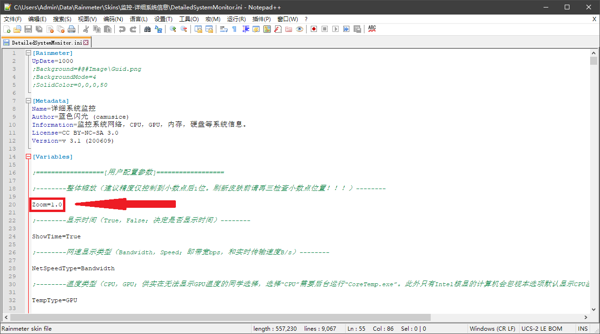
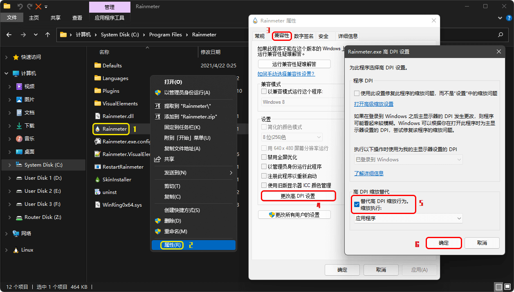
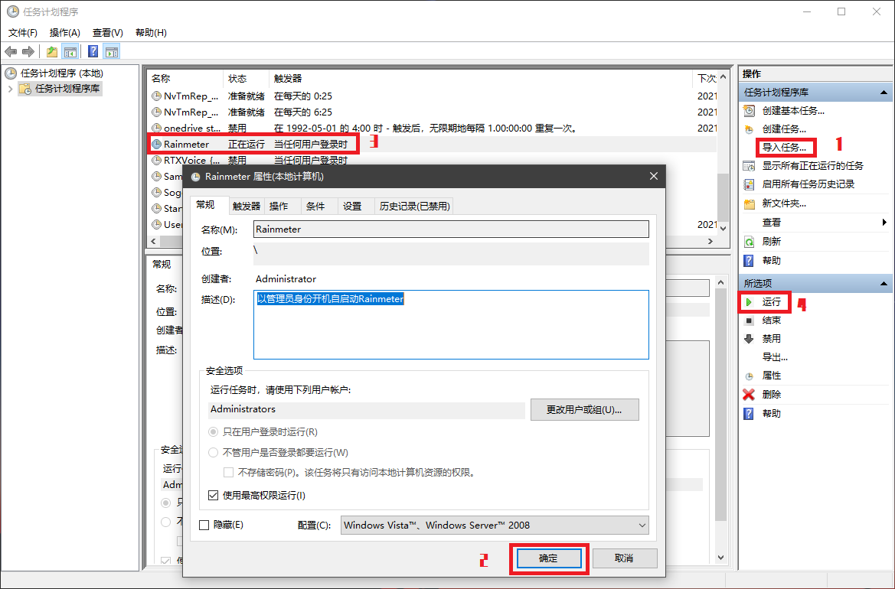
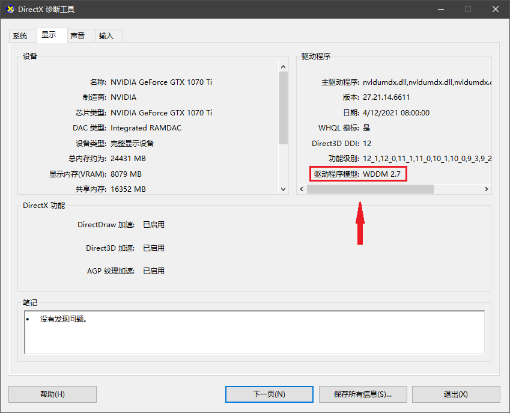

# 问题解答

#### 1. 为什么在我的电脑上，皮肤看起来很小？

　　皮肤默认尺寸为 200 x 755 像素，不同计算机显示器的像素密度不同，在小尺寸但高分辨率屏幕上显示，看起来就会很小。解决方法是打开皮肤目录下的“@Resources\Configs\Settings.inc”文件调整皮肤的缩放比例参数（如下图）：建议固定选择**“1.2”**，**“1.5”**或**“2.0”**。特别注意**刷新皮肤前请检查小数点在正确位置！！**

  

#### 2. 为什么我的皮肤和图片展示的不一样，感觉缺东西？

　　如果您感觉皮肤未显示完整，且使用的是 Windows 7 系统，则是系统无法正确识别皮肤中包含的“Noto Sans CJK.ttc”字体造成的。遇到这种情况，请下载字体修复补丁 [DetailedSystemMonitor_v_FixFont.rmskin](../../../releases/download/v3.3/DetailedSystemMonitor_v_FixFont.rmskin)，并直接安装即可解决问题（百度网盘内也有提供下载）。

　　除了上述情况外，差别主要体现在 GPU 监控相关的内容上。皮肤会根据系统环境和硬件环境自动适应，隐藏当前环境下无法显示的内容。如：受到系统环境影响，Windows 10 1709 以前的系统无法显示非 NVIDIA 显卡的使用率，没有独立显卡的计算机无法显示显存使用情况，等等。如果您实在觉得皮肤在您的计算机上缺少某些内容属于功能性问题，可以按照 [项目首页](../../../) 的说明发出反馈。

#### 3. 为什么使用本皮肤后，我的电脑上其它Rainmeter皮肤的动画每秒钟都会卡顿一次？

　　得益于 Rainmeter 软件本身的高效，该皮肤的 CPU 占用率其实不算高（仅加载了本皮肤的 Rainmeter 大约只有 1-2% 左右）。但是尽管如此，该皮肤每秒内要搜集并刷新大量信息，尤其是 GPU 监测方面，每秒钟要额外更新将近 1000 个变量信息。并且受限于 Rainmeter 本身的刷新机制，整个皮肤的全部信息更新与内容绘制要在 16ms 内完成。因此对于那些本身拥有高刷新率动画的皮肤（如频谱皮肤等）来说，该皮肤的刷新会消耗一部分它们所需的性能。不过正常来说，这些影响基本上微乎其微，且该皮肤也不会对 Rainmeter 以外的软件造成任何影响。

　　解决方法上，开启 Rainmeter 的硬件加速功能（Rainmeter管理器 - 设置）可以将那些高刷新率皮肤的绘制工作交由GPU负责，可以大幅降低 Rainmeter 的 CPU 使用率；或者打开该皮肤配置文件，将第二行的 `Update=1000` 数值调大以降低皮肤刷新率。如果您实在是认定该皮肤影响了您的电脑性能，那只能很遗憾的说：该皮肤不太适合您的电脑。

#### 4. 为什么“显示器分辨率”监控和系统设置的不一样？

　　这是因为您计算机开启了 Windows 的**显示缩放**功能，Rainmeter 识别分辨率错误造成的，请参考下图来进行设置：打开 Rainmeter 的安装目录，鼠标右键点击 `Rainmeter.exe`,属性，兼容性，更改高 DIP 设置，勾选“替代高 DIP 缩放行为”，确定。完成操作后重启 Rainmeter 软件。

  

#### 5. 为什么“显卡温度”显示为“Nun”或者“N/A”？

　　这是一个比较复杂的问题。最开始请先确保您的计算机正确安装了显卡驱动程序。在此基础上，请您根据自己的计算机硬件情况，按照下方列出条件进行诊断：
 * 如果显卡温度显示为“N/A”，且您计算机只拥有 AMD 独立显卡，请检查是否安装了皮肤安装包内携带的 `AMDPlugin.dll` 插件；
 * 如果显卡温度显示为“N/A”，且您的计算机只拥有 NVIDIA 独立显卡，请检查是否安装了皮肤安装包内携带的 `NvidiaGPU.dll` 插件；
 * 如果显卡温度显示为“N/A”，且您的计算机同时拥有核心显卡和独立显卡，请确保独立显卡已经工作（一般双显卡笔记本中，只有高图形运算要求情况，如玩游戏时，才会令独立显卡工作，平时独立显卡处于关闭状态）；
 * 如果显卡温度显示为“N/A”，且您的计算机只有 AMD 核心显卡，您还需要在系统后台运行 [CoreTemp](https://www.alcpu.com/CoreTemp/) 应用；

如果依据上面条件诊断后您的问题依旧，或者皮肤显示为“Nun”，有小概率可能是皮肤适配性问题。请按照 [项目首页](../../../) 的说明发出反馈。但是如果真的走到了这一步，请不要抱太大希望能解决问题。

#### 6. 为什么“CPU温度”显示为“N/A”？

　　首先，只有 Intel 的 CPU 才有显示温度功能；其次，请检查是否安装了皮肤安装包内携带的 `CPUTemp.dll` 插件；再之，**显示 CPU 温度需要 Rainmeter 以管理员身份运行。**

　　若您能确定一定以及肯定 Rainmeter 已经是以管理员身份运行了，请检查您的 Rainmeter 安装目录（默认是“C:\Program Files\Rainmeter”）下是否存在 `WinRing0x64.sys` 文件。若没有，请 [下载](../../../releases/download/v3.3/WinRing0x64.sys) 后放入您的 Rainmeter 安装目录中。

　　此外，如果您使用的的计算机用户不是系统内置的“**Administrator**”，正常情况下 Rainmeter 是无法做到以管理员身份开机自启动运行的。所以需要采用“**计划任务**”进行设置。设置方法：

 * 首先在计算机资源管理器地址栏输入 `shell:startup`，删除启动文件夹中的 Rainmeter 快捷方式来取消原有启动方式；
 * 使用 **Win + R** 调用“运行”，输入 `taskschd.msc` 来调出“**任务计划程序**”；
 * 下载计划任务文件 [Rainmeter.xml](../../../releases/download/v3.3/Rainmeter.xml)，按照下图顺序导入任务，选择文件，确定任务，运行；
 * 若您在安装 Rainmeter 时修改过默认安装目录，请在 “**操作**” 选项卡页面下修改 Rainmeter.exe 的目录位置；
 * 最后重启电脑试验，不出意外 Rainmeter 已经可以成功以管理员身份开机自启动了。如果没能成功，请根据该计划任务每页选项卡的设置，尝试自己创建任务。

  

#### 7. 为什么任何“显卡使用率”都显示为“0”？

　　首先确保您的系统版本在 Windows 10 1709 及以上，然后确保您的计算机显卡驱动程序模型支持 **WDDM 2.4** 及以上。请使用 **Win + R** 调用“运行”，输入 `dxdiag` 来调出“**DirectX 诊断工具**”进行查看。

  

如果上述条件均满足但依旧存在问题，请确认您是否还在 Rainmeter 中加载了其它和“显卡监控”有关的皮肤。若有，尝试关闭相关皮肤，再刷新该皮肤确认情况。若问题没有解决，请按照 [项目首页](../../../) 的说明发出反馈。

#### 8. 为什么“DNS服务器”展示的地址是“网关（路由器）”的地址？

　　当您的计算机网络的“DNS服务器”设置为了 `自动` 可能会导致这样。现在市面上的绝大部分家用路由器均默认接管了其下局域网的DNS设置。

#### 9. 为什么电脑刚开机，但是“开机时长”已经好几天了？

　　这是 Windows 的“快速启动”机制导致的，是系统原因。

#### 10. 为什么网络正常但无法显示“广域网IP”或者“归属地”？

　　由于“广域网 IP”或者“归属地”信息从互联网相关网站进行捕获，若网站进行改版，可能会导致皮肤无法正确获取信息。如果您不了解 Rainmeter 皮肤配置文件的语法，遇到这种情况，除了等待下次皮肤更新外没有其他办法（我们会尽可能在第一时间进行更新）。

　　还有一种情况就是您可能在短时间内过于频繁的刷新了皮肤，导致皮肤不断向网站服务器发送 get 请求，从而被网站服务器认定为恶意攻击，遭到屏蔽。这种情况下请关闭该皮肤，过一段时间后再使用。

