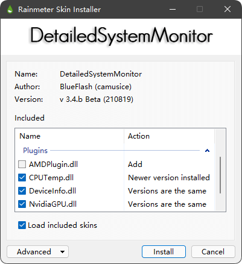

<h1 align="center">详细系统监控</h1>

<b>(Detailed System Monitor)</b>

 

  
  
  
   
  
  
  

 

### 导航

| [**运行要求**](./README.md/#%E8%BF%90%E8%A1%8C%E8%A6%81%E6%B1%82) | [**安装方法**](./README.md/#%E5%AE%89%E8%A3%85%E6%96%B9%E6%B3%95) | [**更新历史**](./README.md/#%E6%9B%B4%E6%96%B0%E5%8E%86%E5%8F%B2) | [**遇到问题**](./README.md/#%E9%81%87%E5%88%B0%E9%97%AE%E9%A2%98) |
| :-: | :-: | :-: | :-: |
| [**参与维护**](./README.md/#%E5%8F%82%E4%B8%8E%E7%BB%B4%E6%8A%A4) | [**相关协议**](./README.md/#%E7%9B%B8%E5%85%B3%E5%8D%8F%E8%AE%AE) | [**其他声明**](./README.md/#%E5%85%B6%E4%BB%96%E5%A3%B0%E6%98%8E) | [**联系作者**](./README.md/#%E8%81%94%E7%B3%BB%E4%BD%9C%E8%80%85) |

 

　　**详细系统监控**（DetailedSystemMonitor，以下均简称为“该皮肤”）是一款全面、直观、高信息密度的，用于监视所在计算机的网络、CPU、GPU、内存、硬盘等相关信息的 [Rainmeter](https://www.rainmeter.net/) 皮肤，旨在将这些系统信息清晰明了地展示在你的桌面上。能兼容市面上绝大多数使用Windows系统的计算机或工作站，并自动适配系统版本及硬件以只展示可以获取的信息。

  

该皮肤目前最新版本为 **3.4.b**。该版本使用新的 `AMDPlugin` 插件来替代原先的 `AMDTemperature` 插件，使用 **Windows 7** 操作系统和 **AMD 独立显卡**的计算机可以展示 **GPU 使用率**和**显存信息**；优化修复一些已知问题。详细内容请查看 [**更新笔记**](Documents/History.md)。

### 运行要求

*  **系统要求：** 该皮肤至少需要 **Windows&reg; 7 SP1** 系统来满足最低程度的信息展示。若要使皮肤展示其全部功能，则需要 **Windows&reg; 10 Fall Creators Update (1709)** 或更高版本系统。

*  **环境要求：** [**.NET Framework 4.5**](https://www.microsoft.com/zh-cn/download/details.aspx?id=30653) 或更高版本。

*  **软件要求：** [**Rainmeter 4.5.1 r3540**](https://www.rainmeter.net/) 或更高版本。

*  **其它要求：** 用户须**以管理员身份运行** Rainmeter 来成功获取 CPU 温度。对于仅有 AMD 核心显卡的计算机，若无法正常显示出 GPU 温度，还需要后台运行 [**CoreTemp**](https://www.alcpu.com/CoreTemp/) 软件。关于如何设置**以管理员身份自启动 Rainmeter**，请查看 [**问题解答#6**](Documents/Q%26A.md#6-%E4%B8%BA%E4%BB%80%E4%B9%88cpu%E6%B8%A9%E5%BA%A6%E6%98%BE%E7%A4%BA%E4%B8%BAna)。

### 安装方法

　　本皮肤的官方发行版会使用 Rainmeter 自带皮肤打包器进行打包，安装包扩展名为 `.rmskin`。已经拥有 Rainmeter 软件的用户可在此仓库直接 [**下载**](../../releases/download/v3.4.b/DetailedSystemMonitor_v_3.4.b.rmskin) 最新的版本安装包到您的计算机，直接双击文件安装。

*  **Windows 7** 操作系统用户安装皮肤后，还需要安装 [**字体修复补丁**](../../releases/download/v3.3/DetailedSystemMonitor_v_FixFont.rmskin)，下载完成直接安装即可。**Windows 10** 操作系统用户无需安装该补丁。

*  安装皮肤时，请注意选择适合您计算机显卡设备的插件：若您的计算机存在 **NVIDIA** 显卡，请在插件栏中只勾选 `NvidiaGPU.dll`（如下图所示）；**AMD** 显卡同理。若您的计算机并非 **Intel** 平台，请取消勾选 `CPUTemp.dll`。

  

*  使用上述方法在默认情况下，新版本将自动覆盖旧版本的皮肤。若您想保留旧版本皮肤，请手动修改旧版本皮肤的文件名或皮肤文件所在目录名称（不推荐）。

### 更新历史

　　您可以在 [**更新笔记**](Documents/History.md) 中查看历史更新记录。如果您想实时了解我最近的更新内容，可以查看本仓库的  分支。

### 遇到问题

　　以下是您可能会遇到的问题：

| | 问题 |
| :-: | - |
| 1 | [为什么在我的电脑上，皮肤看起来很小？](Documents/Q%26A.md#1-%E4%B8%BA%E4%BB%80%E4%B9%88%E5%9C%A8%E6%88%91%E7%9A%84%E7%94%B5%E8%84%91%E4%B8%8A%E7%9A%AE%E8%82%A4%E7%9C%8B%E8%B5%B7%E6%9D%A5%E5%BE%88%E5%B0%8F) |
| 2 | [为什么我的皮肤和图片展示的不一样，感觉缺东西？](Documents/Q%26A.md#2-%E4%B8%BA%E4%BB%80%E4%B9%88%E6%88%91%E7%9A%84%E7%9A%AE%E8%82%A4%E5%92%8C%E5%9B%BE%E7%89%87%E5%B1%95%E7%A4%BA%E7%9A%84%E4%B8%8D%E4%B8%80%E6%A0%B7%E6%84%9F%E8%A7%89%E7%BC%BA%E4%B8%9C%E8%A5%BF) |
| 3 | [为什么使用本皮肤后，我的电脑上其它Rainmeter皮肤的动画每秒钟都会卡顿一次？](Documents/Q%26A.md#3-%E4%B8%BA%E4%BB%80%E4%B9%88%E4%BD%BF%E7%94%A8%E6%9C%AC%E7%9A%AE%E8%82%A4%E5%90%8E%E6%88%91%E7%9A%84%E7%94%B5%E8%84%91%E4%B8%8A%E5%85%B6%E5%AE%83rainmeter%E7%9A%AE%E8%82%A4%E7%9A%84%E5%8A%A8%E7%94%BB%E6%AF%8F%E7%A7%92%E9%92%9F%E9%83%BD%E4%BC%9A%E5%8D%A1%E9%A1%BF%E4%B8%80%E6%AC%A1) |
| 4 | [为什么“显示器分辨率”监控和系统设置的不一样？](Documents/Q%26A.md#4-%E4%B8%BA%E4%BB%80%E4%B9%88%E6%98%BE%E7%A4%BA%E5%99%A8%E5%88%86%E8%BE%A8%E7%8E%87%E7%9B%91%E6%8E%A7%E5%92%8C%E7%B3%BB%E7%BB%9F%E8%AE%BE%E7%BD%AE%E7%9A%84%E4%B8%8D%E4%B8%80%E6%A0%B7) |
| 5 | [为什么“显卡温度”显示为“Nun”或者“N/A”？](Documents/Q%26A.md#5-%E4%B8%BA%E4%BB%80%E4%B9%88%E6%98%BE%E5%8D%A1%E6%B8%A9%E5%BA%A6%E6%98%BE%E7%A4%BA%E4%B8%BAnun%E6%88%96%E8%80%85na) |
| 6 | [为什么“CPU温度”显示为“N/A”？](Documents/Q%26A.md#6-%E4%B8%BA%E4%BB%80%E4%B9%88cpu%E6%B8%A9%E5%BA%A6%E6%98%BE%E7%A4%BA%E4%B8%BAna) |
| 7 | [为什么任何“显卡使用率”都显示为“0”？](Documents/Q%26A.md#7-%E4%B8%BA%E4%BB%80%E4%B9%88%E4%BB%BB%E4%BD%95%E6%98%BE%E5%8D%A1%E4%BD%BF%E7%94%A8%E7%8E%87%E9%83%BD%E6%98%BE%E7%A4%BA%E4%B8%BA0) |
| 8 | [为什么“DNS服务器”展示的地址是“网关（路由器）”的地址？](Documents/Q%26A.md#8-%E4%B8%BA%E4%BB%80%E4%B9%88dns%E6%9C%8D%E5%8A%A1%E5%99%A8%E5%B1%95%E7%A4%BA%E7%9A%84%E5%9C%B0%E5%9D%80%E6%98%AF%E7%BD%91%E5%85%B3%E8%B7%AF%E7%94%B1%E5%99%A8%E7%9A%84%E5%9C%B0%E5%9D%80) |
| 9 | [为什么电脑刚开机，但是“开机时长”已经好几天了？](Documents/Q%26A.md#9-%E4%B8%BA%E4%BB%80%E4%B9%88%E7%94%B5%E8%84%91%E5%88%9A%E5%BC%80%E6%9C%BA%E4%BD%86%E6%98%AF%E5%BC%80%E6%9C%BA%E6%97%B6%E9%95%BF%E5%B7%B2%E7%BB%8F%E5%A5%BD%E5%87%A0%E5%A4%A9%E4%BA%86) |
| 10 | [为什么网络正常但无法显示“广域网IP”或者“归属地”？](Documents/Q%26A.md#10-%E4%B8%BA%E4%BB%80%E4%B9%88%E7%BD%91%E7%BB%9C%E6%AD%A3%E5%B8%B8%E4%BD%86%E6%97%A0%E6%B3%95%E6%98%BE%E7%A4%BA%E5%B9%BF%E5%9F%9F%E7%BD%91ip%E6%88%96%E8%80%85%E5%BD%92%E5%B1%9E%E5%9C%B0) |

如果您的问题不在上述列表，可以在 [**中国雨滴美化社区**](https://bbs.rainmeter.cn/thread-290033-1-1.html) 或 [**rainmeter 百度贴吧**](https://tieba.baidu.com/p/6868066630) 下该皮肤所在的帖子进行回复或直接在本仓库发出  进行提问。

### 参与维护

　　如果您对本皮肤项目感兴趣，有关于本皮肤的更好意见或想法且愿意将你的想法分享给其他人，那么欢迎您加入本皮肤的维护过程。您可以根据自身情况在以下方式中选择一种参与维护：

* 如果您只是一名很普通的 Rainmeter 用户，不太了解 Rainmeter 皮肤的工作方式和文件构成，只是单纯的在使用上有更好的建议或者需求，那么可以在 [**中国雨滴美化社区**](https://bbs.rainmeter.cn/thread-290033-1-1.html) 或 [**rainmeter 百度贴吧**](https://tieba.baidu.com/p/6868066630) 下该皮肤所在的帖子进行回复，或直接在本仓库发出  提出。我将会视情况将您的建议或需求添加到下一次的版本更新中。

* 如果您已经了解该皮肤的工作方式和文件构成，已经修改了该皮肤的副本，但是不太了解 GitHub 的团队工作方式，可以通过下面的 [**联系作者**](../../#%E8%81%94%E7%B3%BB%E4%BD%9C%E8%80%85) 发送你的皮肤修改版本并附加修改内容说明。

* 如果您已经了解该皮肤的工作方式和文件构成，同时还熟悉 Git 和 GitHub 的团队工作方式，可以选择直接  本项目仓库，建立您自己的项目仓库并进行修改。通过  来参与到该皮肤的维护当中。

* 如果您并无问题需要反馈或者有功能上的建议，但愿意提供支持，也可以考虑点击仓库页面左上角的  适当捐助，感谢您的慷慨。

### 相关协议

　　该皮肤 **配置文件**（.ini）、**安装包**（.rmskin）以及该皮肤项目所在 [**GitHub仓库**](https://github.com/Lssg97/DetailedSystemMonitor)、[**Gitee仓库**](https://gitee.com/Lssg97/DetailedSystemMonitor) 中的所有文本内容，除另有声明外，均在 [**知识共享 (Creative Commons) 署名-非商业性使用-相同方式共享 3.0**](LICENSE.md) 协议下提供，附加条款亦可能应用。

　　本仓库内容归 **全体编辑者** 共同所有，在本仓库里发布内容即表示您允许将您编辑的内容 **无偿且自由** 地分享给其他编辑者。

### 其他声明

　　目前该皮肤及其后续更新仅在 [GitHub 仓库](https://github.com/Lssg97/DetailedSystemMonitor) 发布；官方下载渠道有 [GitHub 仓库](https://github.com/Lssg97/DetailedSystemMonitor)、[中国雨滴美化社区](https://bbs.rainmeter.cn/thread-290033-1-1.html) 和 [百度网盘](https://pan.baidu.com/s/1qs4fpEXaxHc3JcyXqNKOfQ)；更新信息的发布渠道包括：[中国雨滴美化社区](https://bbs.rainmeter.cn/thread-290033-1-1.html) 和 [rainmeter 百度贴吧](https://tieba.baidu.com/p/6868066630)。请各位用户认准以上链接。

　　该皮肤最初版本源自互联网，但原作者、创作时间等信息均已无从考证。本人于 2010 年得到该皮肤的原始版本副本，自 2015 年开始致力于维护该皮肤，并在 [中国雨滴美化社区](https://bbs.rainmeter.cn/) 发布过七次独立的版本更新（<https://bbs.rainmeter.cn/thread-141896-1-1.html>）。维护至今，该皮肤无论是结构上还是内容上都已和原始版本大相径庭，属于高度演绎作品。为铭记原始版本作者，该皮肤将继续作为原始版本的延续而发展。

　　该皮肤使用了四个其他开发者制作的 Rainmeter 第三方插件：[AMDPlugin.dll](https://forum.rainmeter.net/viewtopic.php?f=128&t=36120)（NaliLord）、[NvidiaGPU.dll](https://tieba.baidu.com/p/3242119308)（IZZZZZI）、[CPUTemp.dll](https://tieba.baidu.com/p/6855002141)（DeadUniverse）和 DeviceInfo.dll（[a1091817957](https://tieba.baidu.com/home/main/?un=a1091817957)）；旧版本皮肤还曾使用过 [AMDTemperature.dll](https://tieba.baidu.com/p/2221203992)（z100s）；GPU Bar 配色方案由 [mzflh](https://tieba.baidu.com/home/main/?un=mzflh) 提供。感谢各位的技术支持和帮助。

### 联系作者

  <a href="https://wpa.qq.com/msgrd?uin=760265690">760265690</a>
   
  <a href="mailto:lssg97@163.com">lssg97@163.com</a>

